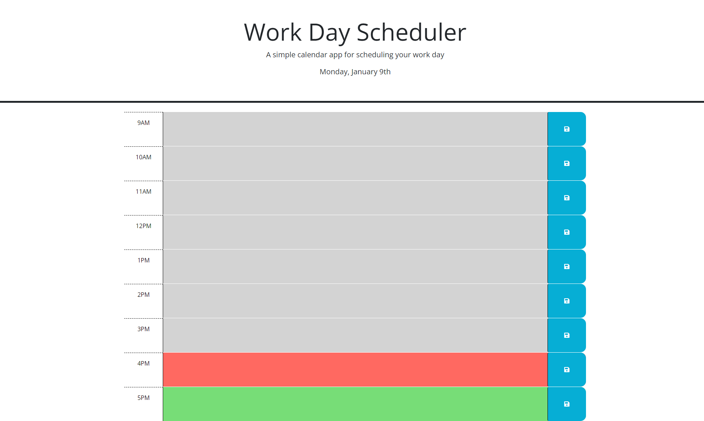
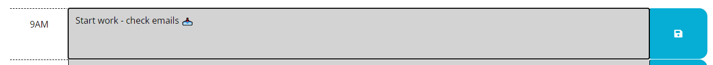
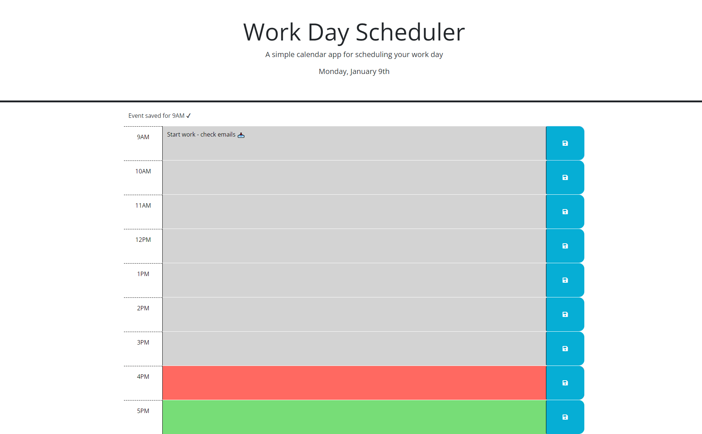

# Daily Planner

## Description

This is a simple calendar day application to save events for each hour of the work day. In creating this app, I was able to practice using jQuery manipulation and practice using a library to work with dates through Day.js.I was also able to work with using Bootstrap a bit in creating the timeline.

## Installation

To use this work day scheduler, the link is found [here](https://claricetran.github.io/daily-planner/).

## Usage

Upon starting a fresh link, the user is displayed with a Work Day Scheduler with description and display of the day of the week and current month and date. The timeline displays from 9AM to 5PM. The area to type events is one of the following colors: gray, red, or green. Gray indicates that the hour is in the past. Red inidcates that the hour is the present. Green indicates that hour is in the future.

To save an event to the calendar, the user can enter text into the textboxes.

Upon hitting the save button, the user gets a short message that their event is saved for their specified hour.

The events that are saved will stay on the browser until the user clears their local cache. Events will persist even if the day changes.

## Credits

[Day.js](https://day.js.org/)
[Computed Property Names Documentation](https://developer.mozilla.org/en-US/docs/Web/JavaScript/Reference/Operators/Object_initializer#computed_property_names);
